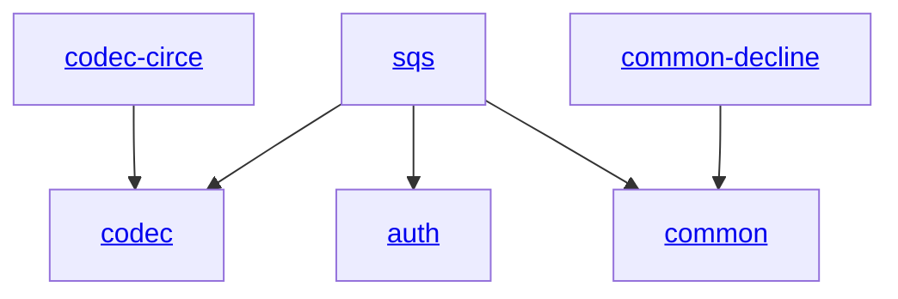

# Modules

Fawn is split into modules so you can just depend on the ones you need.

## auth

Depended on by all core functionality, this implements the [AWS V4 signing standard](https://docs.aws.amazon.com/general/latest/gr/signature-version-4.html) as an http4s middleware.

You can use this if you'd just like to call AWS and have your requests signed.

## sqs

Provides tagless interfaces for dealing with Amazon SQS, see the [SQS Guide](/docs/SQS/making-a-client)

## codec

The Codec module provides `FawnEncoder` and `FawnDecoder` abstractions which are used by the other modules for payloads.

## codec-circe

The Codec Circe module provides `FawnEncoder` and `FawnDecoder` instances based on those from circe, to encode and decode JSON payloads.

## common

The common module contains all of the basic types used to instantiate clients, these include `AWSCredentials`, `AWSRegion` and `AWSService`.

## common-decline

Provides [decline](https://ben.kirw.in/decline/) `Argument`s and `Opts` for CLI parsing of the types in `common` to help users get started quicker.
